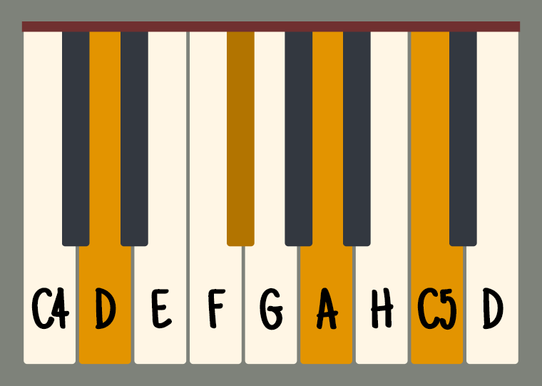

# &lt;piano-keyboard&gt;

Custom web component in vanilla HTML and JS. Creates an SVG image of the piano keyboard and highlights selected keys. Written using custom components API, Shadow DOM and HTML Imports.

<p align="center">
  
</p>

I was too hyped to refactor. But I will refactor, someday 😊

### Demos online

* [Simple demo with styling and parameters](http://antoniak.in/dev/demos/piano-keyboard/simple.html)
* [Page with multiple chords for printing](http://antoniak.in/dev/demos/piano-keyboard/print-chords.html)

## Usage

No magic required! Import element in the `<head>` and add `<piano-keyboard>` in the body:
```<!DOCTYPE HTML>
<html>
  <head>
    <link rel="import" href="piano-keyboard/piano-keyboard.html" />
  </head>
  <body>
    <piano-keyboard></piano-keyboard>
  </body>
</html>
```

## Configuration options

### Parameters

Piano key numbers are from standard piano numbering, where A0 is 1 and C8 is 88.

* `from`: Number of piano key from which to start rendering. Must be a white key.
* `to`: Number of piano key on which to end rendering. Must be a white key.
* `pressed`: Comma-separated list of keys to highlight.


### CSS variable hooks

Set these variables in CSS to modify keyboard appearance. *Note*: Applied styles are SVG styles, what means that not every property from regular CSS can be applied.

* `--white-key-fill`: value of `fill` property of keys belonging to C Major scale
* `--black-key-fill`: value of `fill` for other keys
* `--white-key-pressed-fill`: value of `fill` of pressed keys from C Major
* `--black-key-pressed-fill`: value of `fill` of other keys
* `--top-cover-fill`: value of `fill` of the rectangle covering everything on the top
* `--white-key-stroke`: value of `stroke` of white keys. No stroke by default. Stroke width is set to 1.
* `--note-name-font-family`: `font-family` for text describing notes

## TODO

* Add option to hide note names
* Play sound when key pressed
* Press key when mouse down
* Differentiate between IPN and German notation using H for B
* Think of sensible ARIA descriptions

##  Licensing

Copyright © 2017 Krzysztof Antoniak. Contents of this repository is licensed under GNU General Public License, version 3.0 (GPL-3.0).